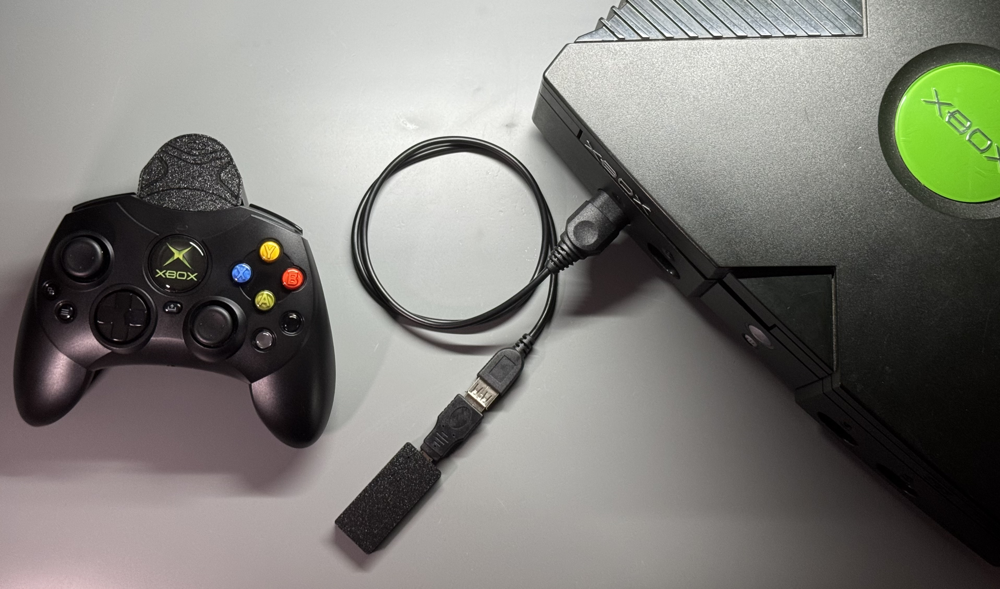
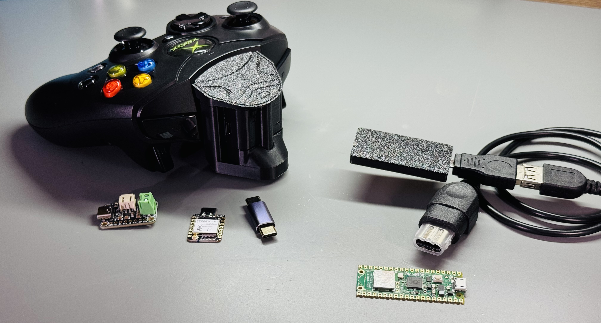
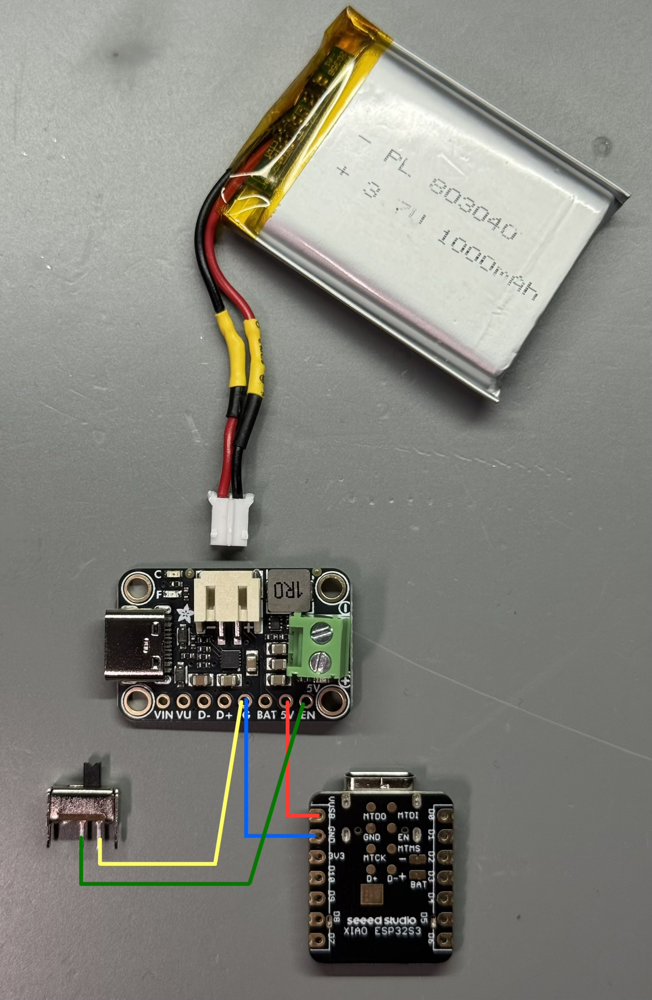

# Duchess-Wireless-to-OGX-Adapters

These adapters convert the wired-only modern controller, The Hyperkin DuchesS, into a wireless controller for the Original Xbox. Hyperkin made this controller to look and feel like the original S controller from Microsoft. The DuchesS uses hall effect sticks and (thankfully) a detachable USB-C cable. It was designed by Hyperkin to only work on modern Xbox consoles and PC. So, I designed these adapters to use it wirelessly on the OG Xbox. This project is non-destructive, keeping the DuchesS controller in its stock form. The intent is for this to be a fun, DIY, open source project.

The adapters are:

Transmitter – converts USB to Bluetooth, attached to the DuchesS controller.

Receiver – converts Bluetooth to USB, connected to the OG Xbox controller port.

<ins>Please consider the following:</ins>

\*I am sharing this project under the following licenses:

Firmware: GPLv3 License - <https://www.gnu.org/licenses/gpl-3.0.txt>

CAD Designs: CERN-OHL-S-2.0 - <https://ohwr.org/cern_ohl_s_v2.txt>

\*The code for this project was fully vibe-coded with Claude Code using Opus 4.8 during prototyping which produced a working build nearly identical to final v1.0 public release. As of v1.0 the source code was cleaned up and finalized for public release using Opus 5.5 (core functionality was all Opus 4.8, for those who care to know that lol).

\*The enclosures are original designs by me using FreeCAD.

\*As of version 1.0, this project only works properly between the transmitter and receiver.

**These adapters do not currently work with other Bluetooth devices. The transmitter uses Bluetooth LE and thus will not connect to Bluetooth Classic dongles. Also, I can connect the Transmitter to my computer, but the controller inputs don’t work properly. It is coded to work with the OG Xbox receiver only.**

<ins>Below you’ll find:</ins>

1. Video Tutorial
2. Parts List
3. Links to Purchase the parts
4. Wiring Diagram
5. Flashing the Firmware instructions
6. Troubleshooting / Notes

 

Please watch the video I made below showing off this project. I explain things in the video that will help anyone considering building this project for themselves.

### [https://youtu.be/EDyjO3ojt0k](https://youtu.be/EDyjO3ojt0k)

  

Parts require purchase from both Mouser and Amazon. Mouser doesn’t sell everything needed. First look through the parts list, then see links attached below for where to buy each item.

<ins>Parts List:</ins>

- Seeed Studio XIAO ESP32-S3 module – microcontroller board for the Transmitter
- Adafruit Bq25185 (Part # 6106) 5V boost version – Charger and boost circuit for Transmitter
- GCT Slide Switch (MFG Part # SWS065-030V12TSK) – On/Off switch for Transmitter
- 803040 Lipo battery 3.7V 1000mAh with JST PH 2.0mm connector – Transmitter battery
- USB-C Male to Male adapter (32.5mm length) – More of an extender/coupler than an adapter\
  **(The length is important here. Anything less than 32mm won’t fit with the current enclosure).**
- Raspberry Pi Pico 2W – microcontroller board for the Receiver
- USB A Male to USB Micro Male adapter – Converts the Pico’s micro USB to Type A USB
- USB A Female to OG Xbox controller port adapter – Converts USB A to Xbox controller input

\*You’ll also need wires, solder, heat shrink tubing if reversing polarity on the battery (you’ll likely need to do this, the video explains why).

I used 28 AWG stranded wire, but anything similar will work.

\*For the enclosures, I use basic PLA filament.

\*For flashing the firmware, I use a USB Micro to USB-A cable for the Pico, and a USB-C to USB-A cable for the ESP32S3. 

 

<ins>-Links to purchase-</ins>

**Mouser project link:** <https://www.mouser.com/en/Tools/Project/Share?AccessID=2832383652>

above link contains the seeed studio ESP32-S3, Adafruit Bq25185, GCT slide switch, Pi Pico 2W.

**Amazon links:** (multiple options in case one goes out of stock, non-affiliate links)

803040 Lipo battery with JST PH 2.0mm connectors -

<https://a.co/d/0bvvcZND>

-or-

<https://a.co/d/07NkPaJw>

USB-C Male to Male adapter 32.5mm total length -

<https://a.co/d/045cscGm>

-or-

<https://a.co/d/06tyFEHX>

USB-A Male to USB Micro Male adapter -

<https://a.co/d/08DQSm7P>

USB-A Female to OG Xbox controller port adapter -

<https://a.co/d/07X1W7fQ>

-or-

<https://a.co/d/00STg7iH>

 

<ins>Wiring Diagram:</ins>

(Notice the polarity of the battery had to be switched to match the charger board!)

\*Instructions for installing the hardware into the Transmitter enclosure are in the video. 

 

<ins>Flashing the Firmware:</ins>

**Transmitter -**

- Download the latest ‘TX_v1.x_merged.bin’ file
- Plug in a USB cable into your computer
- Hold down the “B” (Boot) button on the ESP32S3
- Plug in the other end of the USB cable into the USB-C port of the ESP32S3
- Then release the “B” button on the ESP32S3
- Navigate to the following URL in a Chromium based browser:\
  <https://esptool.spacehuhn.com>
- Click “Connect”
- A Pop-up should appear where you can choose your ESP32S3
- Select it and click “connect” in that pop-up window
- The pop-up window should close
- If a previous firmware already exists, choose “erase” and continue
- Next click the “reset” option on the bottom left of the list on screen\
  (If this is your first time, reset might not do anything, that’s fine. You should see 4 rows listed.)
- Delete rows 2, 3, and 4
- In row 1, delete “1000” and change it to “0”\
  (This starts the binary at 0x0 which is where the merged binary file is designed to start.)
- Click “select” and choose the “...merged.bin” file you downloaded
- Click “Program”
- You should see the Output reads “Done!” and then a message to reset your device (ignore the reset)
- Unplug the ESP32S3 from your computer
- Finished.

**Receiver -**

- Download the latest ‘RX_v1.x_firmware.uf2’ file
- Plug in a USB cable into your computer
- Hold down the BOOTSEL button on the Pi Pico 2W
- Plug in the other end of the USB cable into the USB Micro port of the Pico
- Then release the BOOTSEL button
- Your Pico should show up on your computer similar to a flash drive
- Drag and drop the latest ‘...firmware.uf2’ file into the root directory of the Pico
- The Pico should immediately auto-eject itself from your computer
- Unplug the Pico from your computer
- Finished.

 

<ins>Troubleshooting / Notes:</ins>

\* If the transmitter pairs with the receiver, but the Xbox is not receiving controller inputs. **First, make sure the battery is fully charged.** Also, try unplugging the Transmitter from the DuchesS, flipping the orientation of the USB-C to USB-C adapter (from top to bottom) then reconnect the Transmitter to the DuchesS making sure there is a solid tight connection. Then try connecting again. If that doesn’t work, then try flipping the orientation of the adapter (swapped from which side plugs into the controller and Transmitter). We’re trying to change the path that power is flowing through the little adapter to rule that out. **If the DuchesS doesn’t have a good power connection, you can see a faint, slow flicker on the white LED of the DuchesS controller.** If this doesn’t fix the problem, it could potentially be an issue with the solder connections. The DuchesS needs reliable power to function properly.

\* I wouldn’t recommend using less than a 1000mAh battery. Yes, you can avoid having to reverse the polarity on the battery if you buy a battery from Adafruit. I have not tested this project with less than 1000mAh and I’m confident that on a normal controller, you can get away with less capacity, but on this project, for everything to work properly and last long enough through a gaming session or two, you’ll want to keep the battery charged up and not get low enough that it drops out on you.
